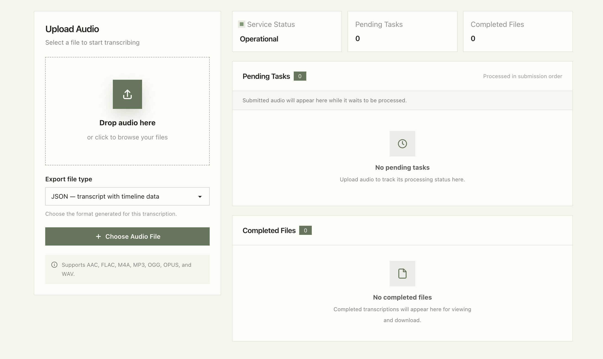

# Audio to Text

A self-hosted web application that converts audio into timestamp-aligned transcripts using [WhisperX](https://github.com/m-bain/whisperX).

Demo: [Hugging Face Spaces](https://huggingface.co/spaces/xiejiapengoo/audio-to-text)



## Features

- Supports AAC, FLAC, M4A, MP3, OGG, OPUS, and WAV audio files.
- Uses WhisperX `large-v3` with automatic language detection and timestamp alignment.
- Exports transcripts as JSON, TXT, or SRT.
- Provides audio preview, upload progress, task status, and result preview.
- Supports canceling tasks and downloading or deleting completed files.

## Requirements

- Python 3.13+
- [uv](https://docs.astral.sh/uv/)
- [FFmpeg](https://ffmpeg.org/) available on `PATH`

## Installation

### Local

```bash
git clone https://github.com/xiejiapengoooo/audio-to-text.git
cd audio-to-text
uv sync --locked
uv run app.py
```

Open [http://localhost:7861](http://localhost:7861).

### Docker

```bash
docker build -t audio-to-text .
docker run --rm \
  -p 7861:7861 \
  -v audio-to-text-data:/root/.audio-to-text \
  -v audio-to-text-cache:/root/.cache \
  audio-to-text
```

Open [http://localhost:7861](http://localhost:7861).

## Roadmap

- [x] Improve the frontend styling.
- [x] Support task cancellation and result deletion.
- [x] Export transcripts as JSON, TXT, and SRT.
- [ ] Add support for large audio files.
- [ ] Add support for video files.
